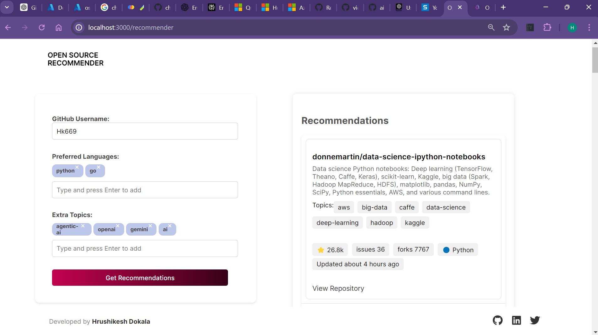

# Open-Source Recommender

This will be a free public-facing web application designed to find open-source projects for beginners and developers.

Search your next contribution to open source easily! A free web app is here to help every developer find cool open-source projects of interest that fit their skillset. Just enter your GitHub username; our intelligent recommender system will do the rest.

## Why Use Open-Source Recommender

- **Perfect for Beginners**: Jump into open source with projects perfect for your current skill level.
- **Tailored Recommendations**: Recommendations on projects based on your GitHub profile, preferred languages and interests.
- **Expand Your Horizons**: New technologies, new projects you never would have crossed.
- **Absolutely Free**: Just free – gift to the developer community.

## How It Works

1. Input your GitHub username
2. Indicate your preferred programming languages and topics of Interest *Optional*
3. Get a personalized list of open source projects matching your profile *Optional*

the app analyzes your Github repositories against the vast database of open source projects from github to provide the best recommended match.

## Features

- **User-Friendly Interface:** Clean, intuitive design for seamless performance.
- **GitHub Integration**: Bases Users and Projects on the GitHub API for proper user data and details of projects
- **Smart Recommendations**: It fits appropriate projects to each user using robust algorithms.
- **Diverse Project Pool**: Multiple projects from different domains and projects which are of any difficulty level
- **Quick Access**: There are multiple direct links to recommended projects to access them fast.

## Get Started

**still under construction*

## Feedback

If you have any suggestions, find any bugs, or have success stories you'd like to share with me, please do so. Your input will make the experience better for all.

## License

This project is licensed under the MIT License. See the [LICENSE](LICENSE) file for details.
